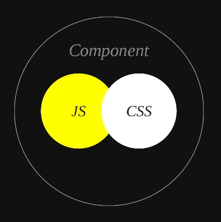

---
title:CSS模块化
date: 2021-01-11 10:10:10
tags: CSS
---

#CSS 模块化


##介绍

模块化是指解决一个复杂问题时自顶向下逐层把系统划分成若干模块的过程，有多种属性，分别反映其内部特性。 ---- 就是把一个大的功能拆解成小功能。

- `相对独立性` -- 避免作用域污染
- `通用性` -- 可复用
- `互换性` -- 可按需加载，从而优化性能 

##为什么 CSS 需要模块化

**现有的 CSS 方案**

```react
// app.css
.button {
  width: 100px;
  height: 20px;
  background: 'red';
}

// app.js
import('app.css');
function App() {
  return <Header><button className="button">红色按钮</button></Header>
}
```

**直接使用 CSS 有什么问题？**

1. CSS 全局作用域问题（后引用覆盖前引用）

```react
// app.css
.button {
  width: 100px;
  height: 20px;
  background: 'red';
}

// app.js
import('app.css');
function App() {
  return <Header><button className="button">红色按钮</button></Header>
}

// app2.css
.button {
  width: 100px;
  height: 20px;
  background: 'green';
}

// app2.js
import('app2.css');
function App2() {
   return <Body><button className="button">绿色按钮</button></Body>
}

// bundle.css
.button {
  width: 100px;
  height: 20px;
  background: 'red';
}

.button {
  width: 100px;
  height: 20px;
  background: 'green';
}
```

2. JS 与 CSS 之间无法共享变量

```react
// app.scss
$color: 'red';

.button {
  width: 100px;
  height: 20px;
  background: $color;
}

// config.js
export default {
  ButtonColor: 'red'
}

// app.js
import('app.scss');
import config from './config';
function App(props) {
  return (
  	<Header>
    	{ config.ButtonColor === 'red' ? <button className="button">红色按钮</button> : null }
    </Header>
  )
}
```

3. 现代框架已经可以将 UI 进行组件化，但是并没有一个 CSS 模块化方案能够匹配上

**如何解决**

CSS 模块化的三种解决方案：

1. CSS 命名约定 *[BEM规范](http://getbem.com/introduction/)*（很早以前）

   BEM — Block Element Modifier

2. 依旧使用 CSS，使用 JS 编译原生的 CSS 文件，使其具备模块化的能力 *[CSS-Modules](https://github.com/css-modules/css-modules)* 

3. 彻底抛弃 CSS，使用 JS 写 CSS 规则，并内联样式 [CSS-IN-JS](https://www.styled-components.com/docs/basics)

## CSS Modules 方案

CSS Modules 既不是官方标准，也不是浏览器的特性，而是在**构建阶段**对 CSS 类名选择器**限定作用域**的一种方式。


### CSS Modules 如何使用

**启用 CSS Modules**

```javascript
// webpack.config.js
 {
   test: /\.css$/i,
     use: [
       'style-loader',
       {
         loader: 'css-loader',
         options: {
           modules: true,
         },
       },
     ],
 },
```


**[css-loader 的配置](https://webpack.docschina.org/loaders/css-loader/#%E9%80%89%E9%A1%B9)**

```javascript
// webpack.config.js
 {
   test: /\.css$/i,
     use: [
       'style-loader',
       {
         loader: 'css-loader',
         options: {
           modules: {
             localIdentName: '[name]__[local]--[hash:base64:5]'
           },
         },
       },
     ],
 },
```


所以就这么一些简单的处理，CSS Modules 实现了以下几点：

- 所有样式都是局部作用域的，解决了全局污染问题
- class 名生成规则配置灵活，可以此来压缩 class 名
- 依然是 CSS，几乎 0 学习成本


###CSS Modules 的实践

**结合 LESS 来使用**

```javascript
{
  test: /\.less$/i,
    use: [
      'style-loader',
      {
        loader: 'css-loader',
        options: {
          modules: {
            localIdentName: '[name]__[local]--[hash:base64:5]',
          },
          importLoaders: 1,
          sourceMap: true,
        },
      },
      {
        loader: 'less-loader',
        options: {
          sourceMap: true,
        },
      },
    ],
},
```


**JS 和 CSS 之间共享变量**

```less
@bg-color: yellow;

:export {
  bgColor: @bg-color;
}
```


**全局与局部的写法**

```css
.btn {
  color: green;
}

/* 与上面的写法等价 */
:local() {
  .btn {
    color: green;
  } 
}

/* 定义全局样式 */
:global() {
  .hr {
    color: red; 
  }
}
```

**local 作用域会加 hash 字符串后缀**

**global 作用域不会加 hash 字符串**


**依赖关系管理**

```css
.btn {
    color: #fff;
    background-color: #1890ff;
    border-color: #1890ff;
}

.disabled {
  /* 1. 导入其他样式 */
  composes: btn
  /* 2. 动态导入样式文件 */
  composes: btn from './style/global.less';
  /* disabled 其它样式 */
  cursor: not-allowed;
  background-color: gray;
}
```

CSS Modules 是很好的 CSS 模块化解决方案，优势很明显，几乎没有学习成本，也不依赖任何的第三方库，并且对代码的侵入性也非常的小。


## CSS-In-JS 方案

### CSS-In-JS 不是一种库

**第一阶段：原始的 HTML 页面**

```html
<div style="font-size:16px;color:red;" onclick="alert('Text')">
  My Text
</div>
```


**第二阶段：关注点分离 -- 不同的技术做不同的事情**


**第三阶段：Web Component 标准**



```react
function App() {
  const styles = {
    fontSize: 16,
    color: 'red',
  }
  return (
    <div style={styles} onClick="alert('Text')">
      My Text
    </div>
  )
}
```

**原始的 HTML 写法是以 HTML 为载体，来写  JS 和 CSS**

**React 是以 JS 为载体，来写 HTML 和 CSS**


**CSS-In-JS 模式**

CSS-In-JS 是一种**把 CSS 直接写在 JS 里的一种模式**，那么目前实现这种模式的第三方库有 [63 种](https://github.com/MicheleBertoli/css-in-js)。


###[Styled Component](https://github.com/styled-components/styled-components)

Styled components -- **以组件的形式写 CSS**


普通写法

```react
const Button = (props) => {
  const { children, ...otherProps } = props;
  return (
    <button
      style={{
        display: 'inline-block',
        border: '1px solid transparent',
        height: '32px',
        color: '#fff',
        backgroundColor: ' #1890ff',
        bordercolor: '#1890ff',
      }} 
      {...otherProps}
    >
      {children}
    </button>
  )
}
```


Styled components 写法 -- 使用了 ES6 的[标签模板](https://es6.ruanyifeng.com/#docs/string#标签模板)方式来定义 CSS 样式，**写法与原生 CSS 完全一致**

```react
const Button = styled.button`
  display: inline-block;
  border: 1px solid transparent;
  height: 32px;
  color: #fff;
  background-color: #1890ff;
  border-color: #1890ff;
`

// styled.button(`css`)
```


**高级用法：**

定义变量 & 逻辑推算

```react
const color = '#1890ff';

export const Button = styled.button`
  display: inline-block;
  border: 1px solid transparent;
  height: 32px;
  color: #fff;
  background-color: ${props => props.red ? 'red' : color};
  border-color: ${color};
`;

```

继承

```react
export const GreenButton = styled(Button)`
  background-color: green;
  border-color: green;
`;
```


**背后的思想：分离逻辑组件和展示组件**

使用 Styled components，可将组件分为逻辑组件和展示组件**，逻辑组件只关注逻辑相关的部分，展示组件只关注样式**。

Styled-components 最基本的理念就是通过**移除样式与组件之间的对应关系**来强制执行最佳实践。


## 总结

我们可以通过CSS 命名约定 *[BEM规范](http://getbem.com/introduction/)*、CSS Modules或者CSS-In-JS 方案实现 CSS 模块化，解决CSS全局作用域覆盖、JS 与 CSS 之间无法共享变量的问题。有利于开发者能够写出健壮并且扩展方便的 CSS，站在工程的角度管理所有的前端资源。