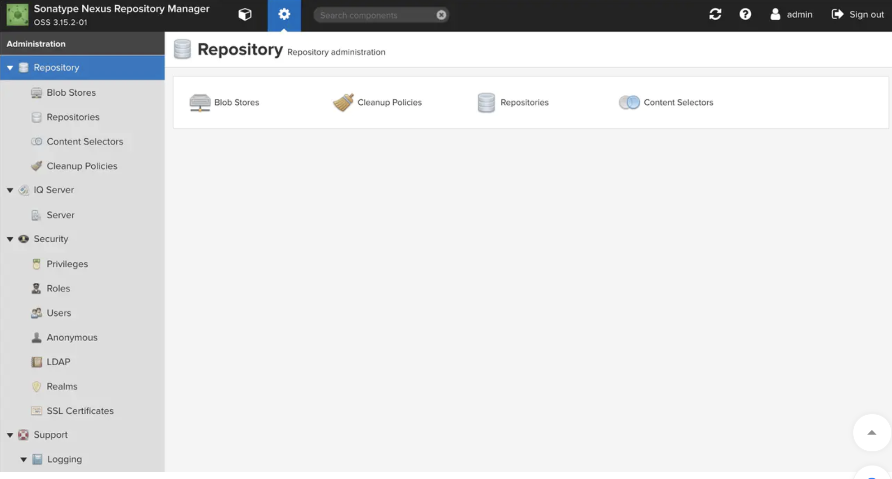
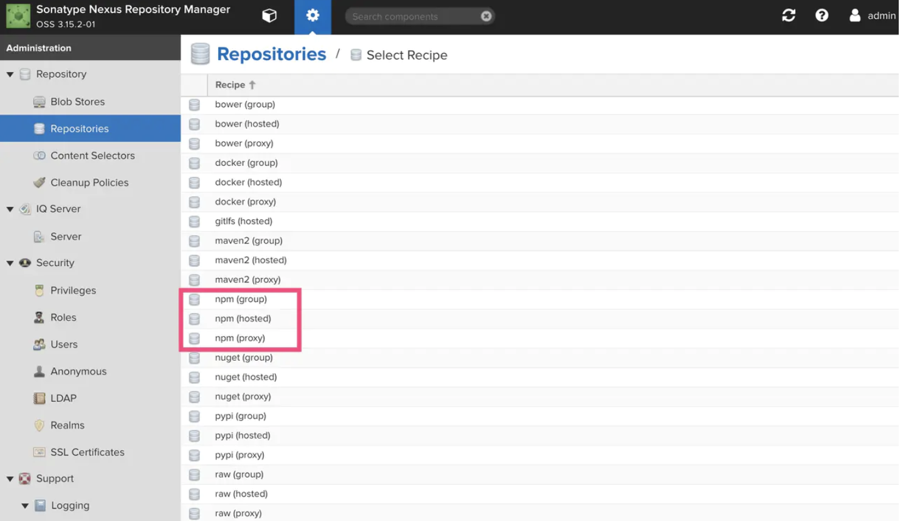
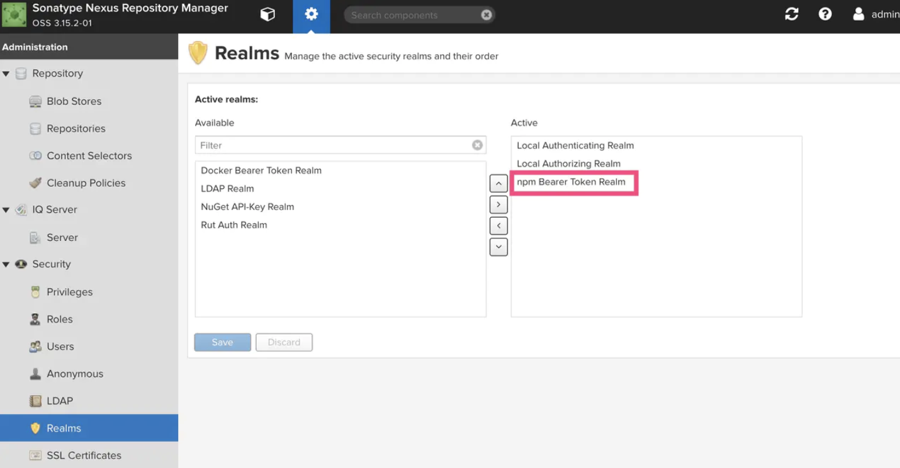
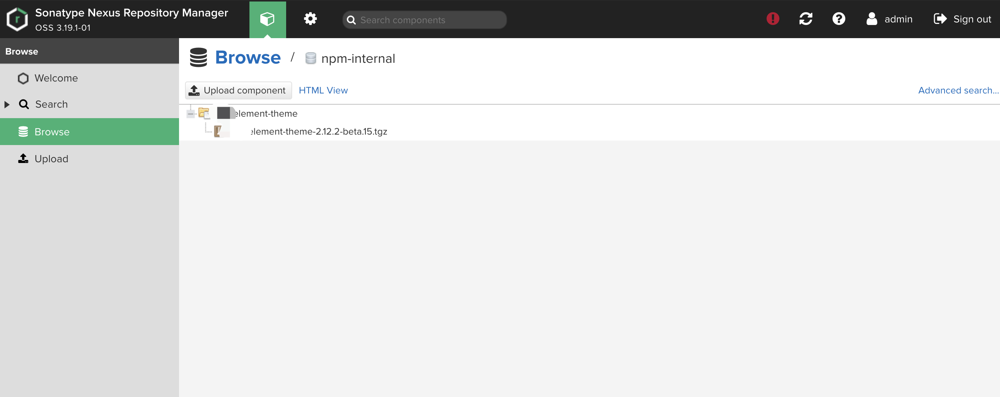

## Nexus搭建npm 私服

### 服务端部署Nexus

- #### 下载解压

  官方下载链接]([help.sonatype.com/repomanager…](https://help.sonatype.com/repomanager3/download))，执行：

  ```bash
  #下载
  $ wget https://download.sonatype.com/nexus/3/latest-unix.tar.gz
  #移动到 /opt 目录
  $ sudo mv latest-unix.tar.gz /opt/nexus3.tar.gz 
  #解压
  $ sudo tar -xzvf nexus3.tar.gz 
  ```

  > 注意运行Nexus需要Java 8 运行时环境(JRE)，请自行安装。

- #### 创建运行用户

  单独创建一个 nexus 用户用来运行

  ```bash
  # 创建用户、指定用户目录、授权
  $ sudo useradd -d /home/nexus -m nexus
  $ sudo chown -R nexus:nexus /home/nexus
  $ sudo chown -R nexus:nexus /opt/nexus-3.15.2-01
  $ sudo chown -R nexus:nexus /opt/sonatype-work/
  ```

  修改运行用户配置项：修改 /opt/nexus-3.15.2-01/bin 目录下的配置文件nexus.rc为 `run_as_user="nexus"`

- #### 运行

  修改端口指8073并开放iptables防火墙，对/opt/sonatype-work/nexus3/etc/nexus.properties文件进行修改:

  ```bash
  # Jetty section                                                     
  application-port=8073
  application-host=0.0.0.0                                                                 # nexus-args=${jetty.etc}/jetty.xml,${jetty.etc}/jetty-http.xml,${jetty.etc}/jetty-requestlog.xml                                               
  # nexus-context-path=/                                                                   # Nexus section                                                                         # nexus-edition=nexus-pro-edition                                                       # nexus-features=\                                                                       #  nexus-pro-feature  
  ```

  启动服务，以下为nexus服务命令:

  ```bash
  # 启动 nexus 服务
  $ sudo service nexus start
  # 重启 nexus 服务
  $ sudo service nexus restart
  # 停止 nexus 服务
  $ sudo service nexus stop
  # 查看 nexus 服务状态
  $ sudo service nexus status 
  ```

  查看日志检查服务状态：

  ```bash
  $ tail -f /opt/sonatype-work/nexus3/log/nexus.log
  ```

  至此，nexus 服务已搭建完毕！可使用默认账号admin/admin123 登录ip:post后对npm仓库进行管理




- #### 仓库管理

  创建仓库，npm 仓库有三种，这三种我们都需要创建



1. npm(proxy) - 代理npm仓库

   将公共 npm 服务器的资源代理缓存，减少重复下载，加快开发人员和CI服务器的下载速度。

   创建时需填写Name(`npm-external`)和Remote Storage(公有库地址，填写官方或淘宝镜像，`https://registry.npmjs.org/`)。

   该仓库地址为：`http://ip:post/repository/npm-external/`

2. npm(hosted) - 私有npm仓库

   用于 上传自己的npm包 以及第三方npm包。

   创建时只需填写Name(`npm-internal`)。

   该仓库地址为：`http://ip:post/repository/npm-internal/`

   > 请注意：发布包时请将registry设为该地址。

3. npm(group) - npm仓库组

   用于将多个内部或外部 npm 仓库统一为一个 npm仓库。可以新建一个npm仓库组将 上面两个刚刚创建的两个 npm 仓库都添加进去。这样可以通过这个 npm仓库组，既可以访问 公有npm仓库 又可以访问自己的 私有npm仓库。

   创建时需填写Name(`npm-all`)，然后选择需要添加到组里的 其他 npm 仓库(`npm-external`和`npm-internal`)。

   该仓库地址为：`http://ip:post/repository/npm-all/`

   > 请注意：安装包以及卸载包时请将registry设为该地址。

- #### 用户管理

  将包发布到nexus npm仓库需要设置一下 Nexus Repository Manager 的权限。否则无法登陆到我们的私服。在Security->Realms栏目里，将`npm Bearer Token Realm` 选入Active。



之后我们需要在Security->Users栏目里添加用户(`需要admin权限否则无法发包`)，只有这样添加的用户才可以发布包。经测试，在客户端使用 `npm adduser` 创建的用户没有发布权限。

> ​	npm adduser添加的用户信息需要时刚刚创建的user信息, 非私服可以使用`npm login`使用npm账号进行发布。

### 客户端使用

####使用 nrm 管理registry

```bash
$npm install -g nrm
 
$ nrm ls
* npm ---- https://registry.npmjs.org/
  cnpm --- http://r.cnpmjs.org/
  taobao - https://registry.npm.taobao.org/
  nj ----- https://registry.nodejitsu.com/
  rednpm - http://registry.mirror.cqupt.edu.cn/
  npmMirror  https://skimdb.npmjs.com/registry/
  edunpm - http://registry.enpmjs.org/
  
$ nrm add ynpm http://XXXXXX:8888 # 添加私服的npm镜像地址
$ nrm use ynpm # 使用私服的镜像地址
```

####安装包

```bash
npm install lodash # sinopia发现本地没有 lodash包,就会从 官方镜像下载
npm --loglevel info install lodash  # 设置loglevel 可查看下载包时的详细请求信息

[storage]$ ls      
#下载过之后，私服的storage目录下回缓存安装包
[storage]$ ls                                                                                   
lodash

rm -rf node-modules # 删除目录
npm insatll lodash # 第二次安装就会从缓存下载了,速度很快
```

####制作包

包的制作其实很简单，只需要`npm init`初始化一个项目，配置`package.json`文件自己所需的信息即可，主要注意下`main`字段所指定的入口文件，也是导出文件。

```js
// index.js
module.exports = function(){}
```

####发布包与撤销发布包

在项目根目录下运行`$ npm publish`发布新包。

运行`$ npm unpublish 包名 --force`撤销发布包。

```bash
$ npm publish
```

查看发布的包，已成功发布：



####作用域scope管理发布包

经常有看到`@xxx/yyy`类型的开源npm包，原因是包名称难免会有重名，如果已经有人在 `npm` 上注册该包名，再次 `npm publish` 同名包时会告知发布失败，这时可以通过 `scope` 作用域来解决

- 定义作用域包

  修改package.json中包名称：

  ```json
  {
       "name": "@username/project-name"
  }
  复制代码
  ```

  > 需要注意的是，如果是发布到官方registry，scope一定要是自己注册的用户名，而如果是发布到自己的npm私服，scope可以不是用户名

- 发布作用域包

  作用域模块默认发布是私有的

  发布到官方registry时，直接`npm publish`会报错，原因是只有付费用户才能发布私有 scope 包，免费用户只能发布公用包，因此需要添加 `access=public` 参数；

  发布到自己的npm私服时，不加`access=public`参数也可以发布

  ```bash
  npm publish --access=public
  ```

- 使用作用域包

  ```bash
  npm install @username/project-name
  ```