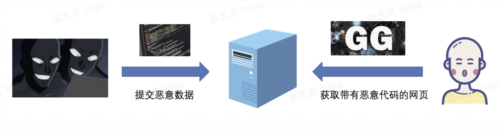
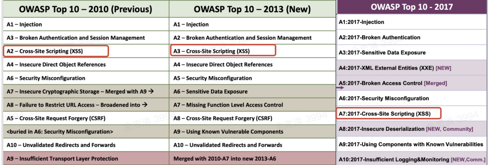
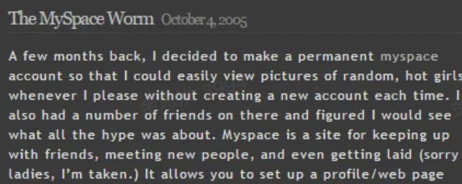
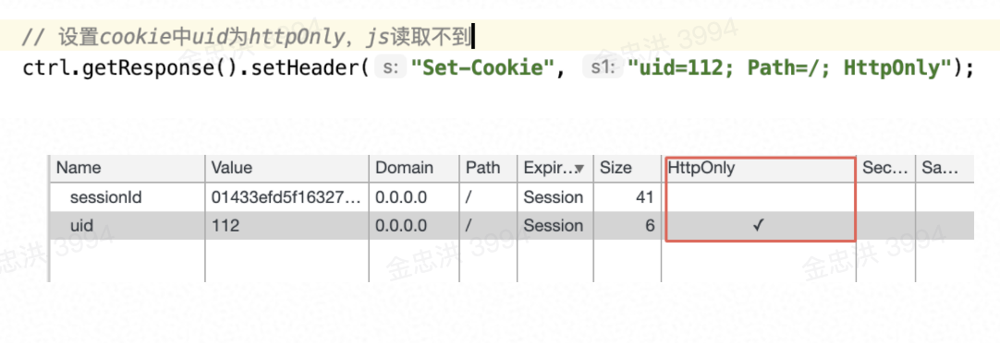

title: XSS 的攻防
date: 2020-08-16 17:10:10
tags:

- web 安全

#XSS 的攻防

> 随着互联网的高速发展，web 应用在互联网中占据的位置也越来越重要，web 安全问题也自然成为了企业最关注的焦点之一。目前，针对 web 的攻击手段层出不穷（比如 SQL 注入、CSRF、XSS 等），虽然浏览器本身也在不断引入 CORS、CSP、Same-Site Cookies 等技术来增强安全性，但是仍存在很多潜在的威胁，需要技术人员不断进行“查漏补缺”。

> 在上述的威胁中，XSS（Crossing-Site Scripting，跨站脚本攻击）是困扰 Web 安全多年的一种常见攻击方式。我们本次主要针对 XSS 的原理和防御方案进行介绍

##介绍

XSS 是 Crossing-Site Scripting（跨站脚本）的英文首字母缩写，因为和 CSS（Cascading Style Sheets 层叠样式表）重名了，所以将 C 改成 X 以区分。

XSS 是一种代码注入攻击，攻击者可以往 Web 页面里插入恶意代码，当其他用户浏览该网页的时候，嵌入 web 里面的代码会被执行，从而达到攻击者特殊目的，比如：

- 破坏网站，导致页面不可用

- 攻击服务端，导致服务拒绝

- 窃取用户 cookie，发送恶意请求

- 安装键盘记录器，窃取用户数据

- 跳转钓鱼页面，窃取账号密码

- ....

XSS 触发的条件包括：

1. 攻击者可以**提交恶意数据**

1. **数据没有被处理**，直接展示到页面上（标签、标签属性、标签事件）

1. **其他用户可以访问**该页面



###由来

介绍完 XSS 的基本概念后，我们来聊一聊 XSS 的历史。XSS 的由来已久，最早可以追溯到上个世纪 90 年代。

1995 年，网景公司为其 Netscape Navigator（网景导航者）浏览器引入 JavaScript，这改变了之前 Web 内容是静态 HTML 的状况。JS 使得网页的交互越来越频繁，促使了 web 的蓬勃发展，但是也带来了新的问题：JS 可以执行服务器发送的代码片段，存在恶意代码注入的巨大安全风险，网页里的恶意代码可以向另外一个服务发送数据。使得攻击者可以利用这个方法窃取敏感信息。

2000 年 2 月，CERT（卡内基梅隆大学计算机紧急回应小组协调中心） 公布了一份 XSS 最早的报告，记载了网页因为疏忽包含了恶意的 html 标签和脚本的案例，以及这些恶意代码会对用户造成什么影响。

**因为 RD 在开发时不可能对所有的用户输入都进行检测和处理，所以 XSS 是广泛长期存在的**。根据[OWASP](https://github.com/OWASP/www-project-top-ten/blob/master/index.md)[ Top 10](https://github.com/OWASP/www-project-top-ten/blob/master/index.md)的统计，XSS 每次都能抢到前排小板凳，2010 年位列第三、2013 年位列第三、2017 年位列第七。



###案例

由于 XSS 漏洞很容易被开发忽略，互联网上已经爆发了多起恶劣攻击事件：

2005 年，19 岁的精神小伙萨米为了增加个人主页的关注量、认识更多的辣妹，在 Myspace 网站上发布了萨米蠕虫病毒。它在每个被感染的用户页面显示一行字串“but most of all, samy is my hero”，并将自己复制在该用户页面。在短短 20 个小时内，超过一百万用户被感染和传播，MySpace 被迫将网站彻底关闭来清理病毒。[源码](https://blog.csdn.net/ssergsw/article/details/9259743)



2006 年，Paypal 遭到 XSS 攻击，攻击者将 PayPal 的访问者重定向到仿制的新页面，在新页面警告用户需要重新设置账号密码，窃取用户信用卡、登陆信息等隐私数据。

2011 年，新浪微博出现了一次比较大的 XSS 攻击事件。大量用户自动发送诸如：“郭美美事件的一些未注意到的细节”，“建党大业中穿帮的地方”，“让女人心动的 100 句诗歌”，“这是传说中的神仙眷侣啊”，“惊爆!范冰冰艳照真流出了”等等微博和私信，并自动关注一位名为 hellosamy 的用户。

2014 年，百度贴吧爆出 XSS 蠕虫漏洞，页面 onmouseovers 时会下载 XSS 脚本，如果是吧务不小心被蠕虫感染了，会在「贴吧意见反馈」里，每 8 秒批量发 100 条「百度 SB」的帖子；任何用户被感染后也会发一个标题比较羞耻的帖子。[源码](https://www.cnblogs.com/milantgh/p/3655112.html)

分类

介绍完 XSS 的黑历史后，你是否对 XSS 稍有兴趣（认识更多的辣妹）？我们接下来会揭开 XSS 的面纱。

目前 XSS 的攻击形式主要分成三类：反射型、存储型、Dom Based 型

| 类型       | 典型攻击步骤                                                                                                                                                                                                        | 常见场景                                                                                      | 区别                                                                                                                 |
| ---------- | ------------------------------------------------------------------------------------------------------------------------------------------------------------------------------------------------------------------- | --------------------------------------------------------------------------------------------- | -------------------------------------------------------------------------------------------------------------------- |
| **反射型** | 攻击者构造出包含恶意代码的特殊的 URL 用户登陆后，访问带有恶意代码的 URL 服务端取出 URL 上的恶意代码，拼接在 HTML 中返回浏览器用户浏览器收到响应后解析执行混入其中的恶意代码窃取敏感信息/冒充用户行为，完成 XSS 攻击 | 通过 URL 传递参数的功能，如网站搜索、跳转等                                                   | 非持久型 xss 攻击，依赖于服务器对恶意请求的反射，仅对当次的页面访问产生影响恶意代码存在 URL 上经过后端，不经过数据库 |
| **存储型** | 攻击者将恶意代码提交到目标网站的数据库中用户登陆后，访问相关页面 URL 服务端从数据库中取出恶意代码，拼接在 HTML 中返回浏览器用户浏览器收到响应后解析执行混入其中的恶意代码窃取敏感信息/冒充用户行为，完成 XSS 攻击   | 带有用户保存数据的网站功能，比如论坛发帖、商品评价、用户私信等等。                            | 持久型 xss，攻击者的数据会存储在服务端，攻击行为将伴随着攻击数据一直存在。恶意代码存在数据库经过后端，经过数据库     |
| **DOM 型** | 前端 JavaScript 取出 URL 中的恶意代码并执行窃取敏感信息/冒充用户行为，完成 XSS 攻击                                                                                                                                 | 页面 JS 获取数据后不做甄别，直接操作 DOM。一般见于从 URL、cookie、LocalStorage 中取内容的场景 | 取出和执行恶意代码由浏览器端完成，属于前端 JavaScript 自身的安全漏洞                                                 |

##如何防御

###针对反射和存储型 XSS

存储型和反射型 XSS 都是在后端取出恶意代码后，插入到响应 HTML 里的，预防这种漏洞主要是关注后端的处理。

####**后端设置白名单，净化数据**

后端对于保存/输出的数据要进行过滤和转义，过滤的内容：比如 location、onclick、onerror、onload、onmouseover 、 script 、href 、 eval、setTimeout、setInterval 等，常见框架：[bluemonday](https://github.com/microcosm-cc/bluemonday)，[jsoup](https://jsoup.org/cookbook/cleaning-html/whitelist-sanitizer)等

```
**String** unsafe =
 "<p><a href='http://example.com/' onclick='stealCookies()'>Link</a></p>";
**String** safe = **Jsoup**.clean(unsafe, **Whitelist**.basic());
// now: <p><a href="http://example.com/" >Link</a></p>
```

转义规则可见【DOM 型 XSS-数据充分转义】

####**避免拼接 HTML，采用纯前端渲染**

浏览器先加载一个静态 HTML，后续通过 Ajax 加载业务数据，调用 DOM API 更新到页面上。纯前端渲染还需注意避免 DOM 型 XSS 漏洞

###针对 DOM 型 XSS

DOM 型 XSS 攻击，实际上就是网站前端 JavaScript 代码本身不够严谨，把不可信的数据当作代码执行了。

####谨慎对待展示数据

谨慎使用.innerHTML、.outerHTML、document.write() ，不要把不可信的数据作为 HTML 插到页面上。

DOM 中的内联事件监听器，如 location、onclick、onerror、onload、onmouseover 等，<a> 标签的 href 属性，JavaScript 的 eval()、setTimeout()、setInterval() 等，都能把字符串作为代码运行，很容易产生安全隐患，谨慎处理传递给这些 API 的字符串。

####**数据充分转义，过滤恶意代码**

需要根据具体场景使用不同的转义规则 [XSS 整体纵深解决方案](https://bytedance.feishu.cn/docs/31Q6A0zwTnIZ1FT6hgVKra#aVdvYh) ，前端插件 [xss.js](https://jsxss.com/zh/index.html)，[DOMPurify](https://github.com/cure53/DOMPurify)

| 放置位置        | 例子                                        | 采取的编码          | 编码格式                                                      |
| --------------- | ------------------------------------------- | ------------------- | ------------------------------------------------------------- |
| HTML 标签之间   | <div> 不可信数据 </div>                     | HTML Entity 编码    | & –> &amp;< –> &lt;> –> &gt;” –> &quot;‘ –> &#x27;/ –> &#x2f; |
| HTML 标签的属性 | <input type=”text”value=” 不可信数据 ” />   | HTML Attribute 编码 | &#xHH                                                         |
| JavaScript      | <script> var msg = ” 不可信数据 ” </script> | JavaScript 编码     | \xHH                                                          |
| CSS             | <div style=” width: 不可信数据 ” > … </div> | CSS 编码            | \HH                                                           |
| URL 参数中      | <a href=”/page?p= 不可信数据 ” >…</a>       | URL 编码            | %HH                                                           |

**编码规则：**除了阿拉伯数字和字母，对其他所有的字符进行编码，只要该字符的 ASCII 码小于 256。编码后输出的格式为以上编码格式 （以&#x、\x 、\、%开头，HH 则是指该字符对应的十六进制数字）

####**使用插值表达式**

采用 vue/react/angular 等技术栈时，使用插值表达式，避免使用 v-html。因为 template 转成 render function 的过程中，会把插值表达式作为 Text 文本内容进行渲染。**在前端 render 阶段避免** **innerHTML\*\***、\***\*outerHTML** **的 XSS 隐患。**

比如：

<div class="a"><span>{{item}}</span></div>

最终生成的代码如下

`"with(this){return _c('div',{staticClass:"a"},[_c('span',[_v(_s(item))])])}"`

\_c 是 createElement 简写，即 render 函数，\_v 是 createTextVNode 的简写，创建文本节点，\_s 是 toString 简写

###其他措施

####**设置 Cookie httpOnly**

禁止 JavaScript 读取某些敏感 Cookie，攻击者完成 XSS 注入后也无法窃取此 Cookie



####**设置 CSP（Content Security Policy）**

CSP 的实质就是设置浏览器白名单，告诉浏览器哪些外部资源可以加载和执行，自动禁止外部注入恶意脚本。

CSP 可以通过两种方式来开启 ：

1. 1. 设置 html 的 meta 标签的方式

```html
<meta http-equiv="Content-Security-Policy" content="script-src 'self' *.bytedance.com ; style-src 'self' ;">
```


1. 1. 设置 HTTP Header 中的 Content-Security-Policy

`Content-Security-Policy: script-src 'self' *.example.com ; style-src 'self' ;`

上述代码描述的 CSP 规则是 js 脚本只能来自当前域名和example.com二级域名下，css 只能来自当前域名

CSP 可以限制**加载资源的类型**：

| **script-src**      | 外部脚本                                                   |
| ------------------- | ---------------------------------------------------------- |
| **style-src**       | 样式表                                                     |
| **img-src**         | 图像                                                       |
| **media-src**       | 媒体文件（音频和视频）                                     |
| **font-src**        | 字体文件                                                   |
| **object-src**      | 插件（比如 Flash）                                         |
| **child-src**       | 框架                                                       |
| **frame-ancestors** | 嵌入的外部资源（比如<frame>、<iframe>、<embed>和<applet>） |
| **connect-src**     | HTTP 连接（通过 XHR、WebSockets、EventSource 等）          |
| **worker-src**      | worker 脚本                                                |
| **manifest-src**    | manifest 文件                                              |
| **default-src**     | 用来设置上面各个选项的默认值                               |

同时也可设置**资源的限制规则**

| 主机名              | [example.org](http://example.org)，https://example.com:443                                                           |
| ------------------- | -------------------------------------------------------------------------------------------------------------------- |
| 路径名              | [example.org/resources/js/](http://example.org/resources/js/)                                                        |
| 通配符              | _.[example.org](http://example.org)，_://_.[example.com](http://example.com):_（表示任意协议、任意子域名、任意端口） |
| 协议名              | https:、data:                                                                                                        |
| **'self'**          | 当前域名，需要加引号                                                                                                 |
| **'none'**          | 禁止加载任何外部资源，需要加引号                                                                                     |
| **'unsafe-inline'** | 允许执行页面内嵌的<script>标签和事件监听函数                                                                         |
| **'unsafe-eval'**   | 允许将字符串当作代码执行，比如使用 eval、setTimeout、setInterval 和 Function 等函数                                  |

严格的 CSP 在 XSS 的防范中可以起到以下的作用：

- 禁止加载外域代码，防止复杂的攻击逻辑
- 禁止外域提交，网站被攻击后，用户的数据不会泄露到外域
- 禁止内联脚本执行
- 禁止未授权的脚本执行

####输入内容长度、类型的控制

对于不受信任的输入，都应该限定一个合理的长度，并且对输入内容的合法性进行校验（例如输入 email 的文本框只允许输入格式正确的 email，输入手机号码的文本框只允许填入数字且格式需要正确）。虽然无法完全防止 XSS 发生，但可以增加 XSS 攻击的难度。

####**验证码**，防止脚本冒充用户提交危险操作

###如何检测

目前主要 2 种方式检测项目的 XSS 漏洞：

####使用通用 XSS 攻击字符串手动检测 XSS 漏洞

在[Unleashing an Ultimate XSS Polyglot](https://github.com/0xsobky/HackVault/wiki/Unleashing-an-Ultimate-XSS-Polyglot)一文中，有这么一个字符串：

```
jaVasCript:/*-/*`/*\`/*'/*"/**/(/* */oNcliCk=alert() )//%0D%0A%0d%0a//</stYle/</titLe/</teXtarEa/</scRipt/--!>\x3csVg/<sVg/oNloAd=alert()//>\x3e
```

它能够检测到存在于 HTML 属性、HTML 文字内容、跳转链接、内联 JavaScript 字符串等多种上下文中的 XSS 漏洞，也能检测 eval()、setTimeout()、setInterval()、Function()、innerHTML、document.write() 等 DOM 型 XSS 漏洞。只要在网站的各输入框中提交这个字符串，或者把它拼接到 URL 参数上，就可以进行检测了。

```
http://xxx/search?keyword=jaVasCript%3A%2F*-%2F*%60%2F*%60%2F*%27%2F*%22%2F**%2F(%2F*%20*%2FoNcliCk%3Dalert()%20)%2F%2F%250D%250A%250d%250a%2F%2F%3C%2FstYle%2F%3C%2FtitLe%2F%3C%2FteXtarEa%2F%3C%2FscRipt%2F--!%3E%3CsVg%2F%3CsVg%2FoNloAd%3Dalert()%2F%2F%3E%3E
```

####使用扫描工具自动检测 XSS 漏洞（[BeEF](https://beefproject.com/)、[w3af](https://github.com/andresriancho/w3af) 、 [noXss](https://github.com/lwzSoviet/NoXss)等）

大部分扫描工具是利用动态检测思想：寻找目标应用程序中所有可能出现漏洞的地方，包括表单中的输入框、富文本、密码等，然后构造特殊攻击字符串作为输入，模拟触发事件向服务器提交请求，然后获取服务器的 HTTP 相应，并在其中寻找之前构造的字符串，如果可以找到，说明服务器网页没有对输入过滤，也就是存在 XSS 漏洞。

##其他

XSS 是一个比较大的话题，本篇文章主要介绍 XSS 的基本概念和常用防范手段。其他更多有意思的东西（比如 XSS 盲打、服务端标记 HTML 防 XSS 攻击、Ascii 编码绕过检测等），大家感兴趣的话可以再深入学习。

更多参考资料

1. 李冬萌. Web 前端安全问题的分析与防范研究[D]. 北京邮电大学, 2014.

1. 万本钰. 基于浏览器的 XSS 检测系统的研究与设计[D]. 2019.

1. 刘海, 徐芳, 郭帆, et al. 防范 XSS 攻击的研究综述[J]. 计算机与现代化, 2011, 2011(8):174-178.

1. [如何防止 XSS 攻击](https://tech.meituan.com/2018/09/27/fe-security.html)

1. [XSS 整体纵深解决方案](https://bytedance.feishu.cn/docs/31Q6A0zwTnIZ1FT6hgVKra#VJ21IE)

1. [防御 XSS 的七条原则](https://sking7.github.io/articles/430468050.html)

1. [HtmlEncode&JavaScriptEncode](https://www.cnblogs.com/lovesong/p/5211667.html)

1. [DOMXSS 典型场景分析与修复指南](https://security.tencent.com/index.php/blog/msg/107)

1. [Content Security Policy](http://www.ruanyifeng.com/blog/2016/09/csp.html)

1. [XSS 过滤绕过速查表](https://www.freebuf.com/articles/web/153055.html)

1. [XSS 绕过方式](https://cloud.tencent.com/developer/article/1180217)
