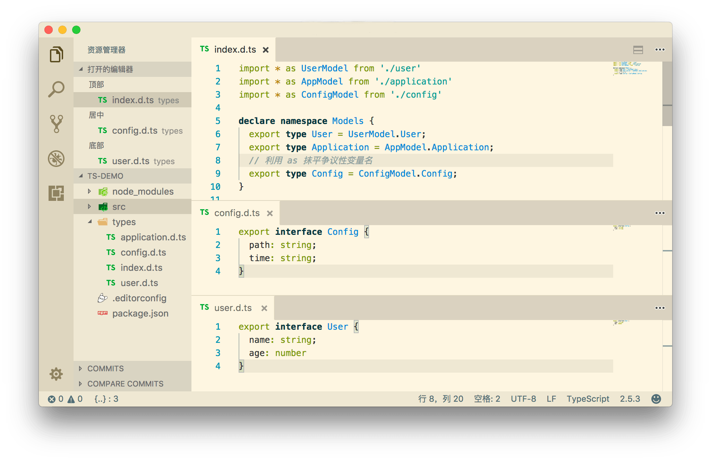

## 类型定义文件

在 TypeScript 中，我们可以很简单的，在代码编写中定义类型：

```typescript
interface IBaseModel {
  say(keys: string[] | null): object
}

class User implements IBaseModel {
  name: string
  constructor (name: string) {
    this.name = name
  }
}
```

但是主流的库都是 JavaScript 编写的，TypeScript 身为 JavaScript 的超集，自然需要考虑到如何让 JS 库也能定义静态类型。

TypeScript 经过了一系列的摸索，先后提出了 [tsd](https://tasaid.com/link?url=https%3A%2F%2Fgithub.com%2FDefinitelyTyped%2Ftsd)(已废弃)、[typings](https://tasaid.com/link?url=https%3A%2F%2Fgithub.com%2Ftypings%2Ftypings)(已废弃)，最终在 TypeScript 2.0 的时候重新整理了类型定义，提出了 [DefinitelyTyped](https://tasaid.com/link?url=https%3A%2F%2Fgithub.com%2FDefinitelyTyped%2FDefinitelyTyped)。

[DefinitelyTyped](https://tasaid.com/link?url=https%3A%2F%2Fgithub.com%2FDefinitelyTyped%2FDefinitelyTyped) 就是让你把 "类型定义文件(*.d.ts)"，发布到 `npm` 中，配合编辑器(或插件)，就能够检测到 JS 库中的静态类型。

类型定义文件的以 `.d.ts` 结尾，里面主要用来定义类型。

例如这是 [jQuery 的类型定义文件](https://tasaid.com/link?url=https%3A%2F%2Fgithub.com%2FDefinitelyTyped%2FDefinitelyTyped%2Ftree%2Fmaster%2Ftypes%2Fjquery) 中一段代码（为了方便理解做了一些改动）

```typescript
// 定义 jQuery 需要用到的类型命名空间
declare namespace JQuery {
    // 定义基本使用的类型
    type Selector = string;
    type TypeOrArray<T> = T | T[];
    type htmlString = string;
}

// 定义 jQuery 接口，jquery 是一个 包含 Element 的集合
interface JQuery<TElement extends Node = HTMLElement> extends Iterable<TElement> {
    length: number;
    eq(index: number): this;

    // 重载
    add(selector: JQuery.Selector, context: Element): this;
    add(selector: JQuery.Selector | JQuery.TypeOrArray<Element> | JQuery.htmlString | JQuery): this;

    children(selector?: JQuery.Selector): this;
    css(propertyName: string): string;
    html(): string;
}

// 对模块 jquery 输出接口
declare module 'jquery' {
    // module 中要使用 export = 而不是 export default
    export = jQuery;
}
```

## 类型定义

`*.d.ts` 编写起来非常简单，经过 TypeScript 良好的静态类型系统洗礼过后，语法学习成本非常低。

我们可以使用 `type` 用来定义类型变量：

```typescript
// 基本类型
type UserName = string

// 类型赋值
type WebSite = string
type Tsaid = WebSite
```

可以看到 `type` 其实可以定义各种格式的类型，也可以和其他类型进行组合。

```typescript
// 对象
type User = {
  name: string;
  age: number;
  website: WebSite;
}

// 方法
type say = (age: number) => string

// 类
class TaSaid {
  website: string;
  say: (age: number) => string;
}
```

当然，我们也可以使用 `interface` 定义我们的复杂类型，在 TS 中我们也可以直接定义 `interface`：

```typescript
interface Application {
    init(): void
    get(key: string): object
}
```

`interface` 和 `type`(或者说 `class`) 很像。

但是 `type` 的含义是定义自定义类型，当 TS 提供给你的基础类型都不满足的时候，可以使用 `type` 自由组合出你的新类型，而 `interface` 应该是对外输出的接口。

`type` 不可以被继承，但 `interface` 可以：

```typescript
interface BaseApplication {
    appId: number
}

export interface Application extends BaseApplication {
  init(): void
    get(key: string): object
}
```

## declare

`declare` 可以创建 `*.d.ts` 文件中的变量，`declare` 只能作用域最外层：

```typescript
declare var foo: number;
declare function greet(greeting: string): void;

declare namespace tasaid {
  // 这里不能 declare
  interface blog {
    website: 'http://tasaid.com'
  } 
}
```

基本上顶层的定义都需要使用 `declare`， `class` 也是：

```typescript
declare class User {
  name: string
}
```

## namespace

为防止类型重复，使用 `namespace` 用于划分区域块，分离重复的类型，顶层的 `namespace` 需要 `declare` 输出到外部环境，子命名空间不需要 `declare`。

```typescript
// 命名空间
declare namespace Models {
  type A = number
  // 子命名空间
  namespace Config {
    type A = object
    type B = string
  }
}

type C = Models.Config.A
```

## 组合定义

上面我们只演示了一些简单的类型组合，生产环境中会包含许多复杂的类型定义，这时候我们就需要各种组合出强大的类型定义：

### 动态属性

有些类型的属性名是动态而未知的，例如：

```javascript
{
  '10086': {
    name: '中国移动',
    website: 'http://www.10086.cn',
  },
  '10010': {
    name: '中国联通',
    website: 'http://www.10010.com',
  },
  '10000': {
    name: '中国电信',
    website: 'http://www.189.cn'
  }
}
```

我们可以使用动态属性名来定义类型：

```typescript
interface ChinaMobile {
  name: string;
  website: string;
}

interface ChinaMobileList {
  // 动态属性
  [phone: string]: ChinaMobile
}
```

### 类型遍历

当你已知某个类型范围的时候，可以使用 `in` 和 `keyof` 来遍历类型，例如上面的 ChinaMobile 例子，我们可以使用 `in` 来约束属性名必须为三家运营商之一：

```typescript
type ChinaMobilePhones = '10086' | '10010' | '10000'

interface ChinaMobile {
  name: string;
  website: string;
}

// 只能 type 使用， interface 无法使用
type ChinaMobileList = {
  // 遍历属性
  [phone in ChinaMobilePhones]: ChinaMobile
}
```

我们也可以用 `keyof` 来约定方法的参数

```typescript
export type keys = {
  name: string;
  appId: number;
  config: object;
}

class Application {
  // 参数和值约束范围
  set<T extends keyof keys>(key: T, val: keys[T])
  get<T extends keyof keys>(key: T): keys[T]
}
```


## import 导入和 export 导出

js 中有多种 `import` 和 `export`模块的方式，所以在 `d.ts` 中也对应有着不同的导入导出方式。

### 导入规则

在 ts 中不同的 `import` 语法会决定如何解析这个 module：

- 有类型声明，标准 es module 库：`import * as xxxx from ''` 或 `import xxx from ''` 导入
- 有类型声明，标准 commonjs 库： `import xxx = require('')` 导入
- 没有类型声明：`const xxx = require('')` 导入（默认导入为 any 类型）

同样，js 中不同的 `export` 语法也对应着不同的声明方式。

### export default

如果 js 是 `es6 module` 风格的，通过 `export default` 导出的，经过编译工具编译为 `export.default` 以后(一般为 babel 或其他工具编译)，则声明文件这样写：

js 源文件：

```js
export default function (options) { }

// 编译后
exports.default = function (options) { }
```

d.ts 声明文件：

```ts
// 导出接口声明
export interface Options { }

// 声明默认函数
declare function main (options: Options): void

// 导出默认值
export default main
```

特点是这样引入(在 `tsconfig.json` 中没有开启 `allowSyntheticDefaultImports` 选项的情况下)：

```ts
// 导入包
import * as demo from 'demo'
import { Options } from 'demo'

// 调用默认方法
demo({ })
```

### module.exports

如果 js 是 `commonjs` 风格的，是通过 `module.exports` 导出的，则声明文件这样写：

js 源文件：

```js
module.exports = function (options) { }
```

d.ts 声明文件：

```ts
// 包的声明
declare function main (options: main.Options): void

// 包里面的接口通过 namespace 声明
declare namespace main {
  // 导出接口声明
  export interface Options { }
}

// 导出包默认声明
export = main
```

特点是这样引入：

```ts
// 导入包
import demo = require('demo')
// 导入接口声明
import { Options } from 'demo'

// 调用默认方法
demo({ })
```

### export xxx

如果只是普通的 `exports xxx` ，经过编译工具编译为 `export.xxx` 之后，则声明文件相对简单：

js 源文件：

```js
export const func = (options) => { }

// 编译为
exports.func = function (options) { }
```

d.ts 声明文件：

```ts
// 导出接口声明
export interface Options { }

export declare const func: (options: Options) => void
```

引入方式：

```ts
// 导入接口声明
import { Options, func } from 'demo'

// 调用
func({ })
```

## 集成发布

有两种主要方式用来发布类型定义文件到 `npm`：

1. 与你的 npm 包捆绑在一起(内置类型定义文件)
2. 发布到 npm 上的 [@types organization](https://tasaid.com/link?url=https%3A%2F%2Fwww.npmjs.com%2F~types)

前者，安装完了包之后会自动检测并识别类型定义文件。 后者，则需要通过 `npm i @types/xxxx` 安装，这就是我们前面所说的 [DefinitelyTyped](https://tasaid.com/link?url=https%3A%2F%2Fgithub.com%2FDefinitelyTyped%2FDefinitelyTyped) ，用于扩展 JS 库的类型声明。

### 内置类型定义文件

内置类型定义就是把你的类型定义文件和 npm 包一起发布，一般来说，类型定义文件都放在包根目录的 `types` 目录里，例如 [vue](https://tasaid.com/link?url=https%3A%2F%2Fgithub.com%2Fvuejs%2Fvue%2Ftree%2Fv2.5.2%2Ftypes)：

如果你的包有一个主 `.js` 文件，需要在 `package.json` 里指定主类型定义文件。

设置 `types` 或 `typeings` 属性指向捆绑在一起的类型定义文件。 例如包目录如下：

```bash
├── lib
│   ├── main.js
│   └── main.d.ts # 类型定义文件
└── package.json
// pageage.json
{
    "name": "demo",
    "author": "demo project",
    "version": "1.0.0",
    "main": "./lib/main.js",
    // 定义主类型定义文件
    "types": "./lib/main.d.ts"
}
```

如果主类型定义文件名是 `index.d.ts` 并且位置在包的根目录里，就不需要使用 `types` 属性指定了。

```bash
├── lib
│   └── main.js
├── index.d.ts # 类型定义文件
└── package.json
```

如果你发的包中，`package.json` 中使用了 `files` 字段的话（`npm` 会根据 `files` 配置的规则决定发布哪些文件），则需要手动把类型定义文件加入：

```javascript
// pageage.json
{
  "files": [
    "index.js",
    "*.d.ts"
  ]
}
```

如果只发二级目录的话，把类型定义文件放到对应的二级目录下即可：

```typescript
import { default as App } from 'demo/app'
```

### 发布到 @types organizatio

发布到 `@types organizatio` 的包表示源包没有包含类型定义文件，第三方/或原作者定义好类型定义文件之后，发布到 [@types](https://tasaid.com/link?url=https%3A%2F%2Fwww.npmjs.com%2F~types) 中。例如 [@types/express](https://tasaid.com/link?url=https%3A%2F%2Fwww.npmjs.com%2Fpackage%2F%40types%2Fexpress)。

根据 `DefinitelyTyped` 的规则，和编辑器(和插件) 自动检测静态类型。

[@types](https://tasaid.com/link?url=https%3A%2F%2Fwww.npmjs.com%2F~types) 下面的包是从 [DefinitelyTyped](https://tasaid.com/link?url=https%3A%2F%2Fgithub.com%2FDefinitelyTyped%2FDefinitelyTyped) 里自动发布的，通过 [types-publisher](https://tasaid.com/link?url=https%3A%2F%2Fgithub.com%2FMicrosoft%2Ftypes-publisher) 工具。

如果想让你的包发布为 @types 包，需要提交一个 pull request 到 [https://github.com/DefinitelyTyped/DefinitelyTyped](https://tasaid.com/link?url=https%3A%2F%2Fgithub.com%2FDefinitelyTyped%2FDefinitelyTyped)。

在这里查看详细信息 [contribution guidelines page](https://tasaid.com/link?url=http%3A%2F%2Fdefinitelytyped.org%2Fguides%2Fcontributing.html)。

如果你正在使用 TypeScript，而使用了一些 JS 包并没有对应的类型定义文件，可以编写一份然后提交到 `@types`。

赠人玫瑰，手留余香。

发布到 `@types organizatio` 的包可以通过 [TypeSearch](https://tasaid.com/link?url=https%3A%2F%2Fmicrosoft.github.io%2FTypeSearch%2F) 搜索检索，使用 `npm install --save-dev @types/xxxx` 安装：


更多细节请参阅 [DefinitelyTyped](https://tasaid.com/link?url=https%3A%2F%2Fgithub.com%2FDefinitelyTyped%2FDefinitelyTyped)。

## 其他

### 为第三方包声明类型

通常来说，如果这份类型定义文件是 JS 库自带的，那么我们可以直接导出模块：

```typescript
interface User {}
export = User
```

而如果这份类型定义文件不是 JS 库自带的，而是第三方的，则需要使用 `module` 进行关联。

例如 `jquery` 发布的 npm 包中不包含 `*.d.ts` 类型定义文件，`jquery` 的类型定义文件发布在了 `@types/jquery`，所以类型定义文件中导出类型的时候，需要关联模块 `jquery`，意思就是我专门针对这个包做的类型定义：

```typescript
interface jQuery {}
declare module 'jquery' {
    // 因为 jquery 使用的是 commonjs module，所以需要用 export 导出
    // es6 module 可以使用 export default 导出
    export = jQuery;
}
```

从而解决了一些主流的 JS 库发布的 `npm` 包中没有类型定义文件，但是我们可以用第三方类型定义文件为这些库补充类型。

### 风格

经过一系列探索，个人比较推荐下面的编写风格，先看目录：

```bash
types
├── application.d.ts
├── config.d.ts
├── index.d.ts # 入口模块
└── user.d.ts
```



入口模块主要做这些事情：

1. 定义命名空间
2. 导出和聚合子模块

主出口文件 `index.d.ts`：

```typescript
import * as UserModel from './user'
import * as AppModel from './application'
import * as ConfigModel from './config'

declare namespace Models {
  export type User = UserModel.User;
  export type Application = AppModel.Application;
  // 利用 as 抹平争议性变量名
  export type Config = ConfigModel.Config;
}
```

子模块无需定义命名空间，这样外部环境 (`types` 文件夹之外) 则无法获取子模块类型，达到了类型封闭的效果：

```typescript
export interface User {
  name: string;
  age: number
}
```