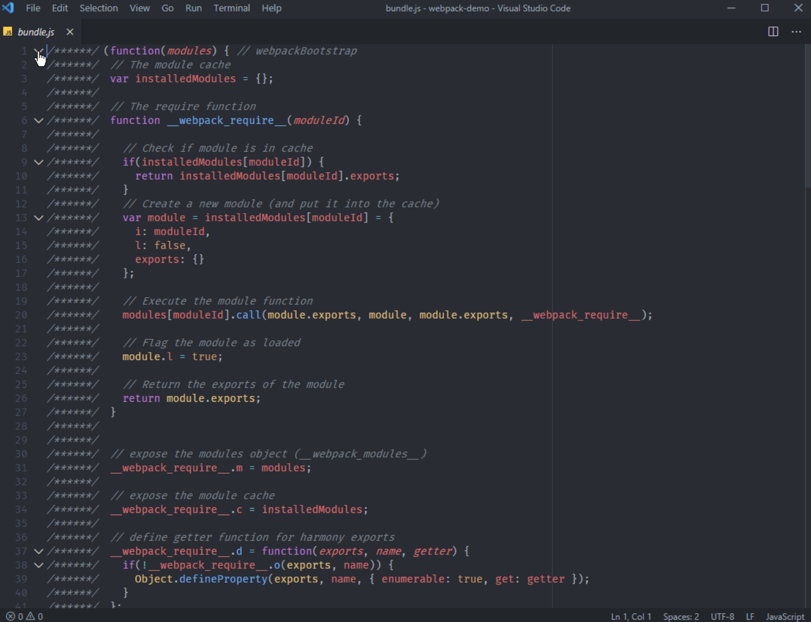
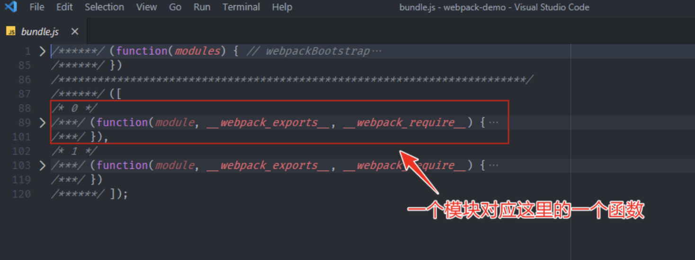
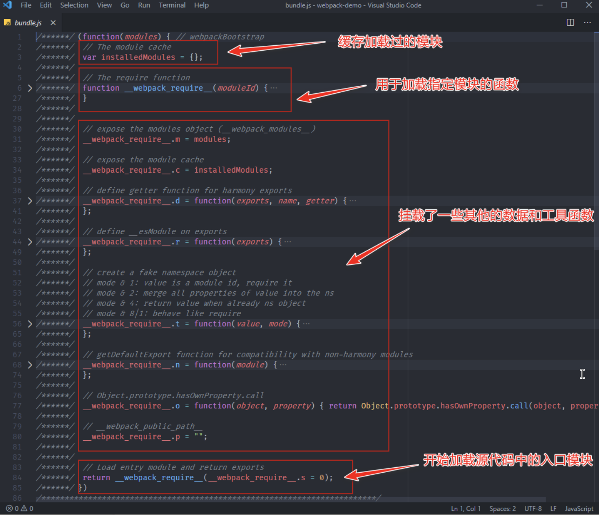

## Webpack学习-深入浅出

### 简介

> **webpack** 是一个用于现代 JavaScript 应用程序的*静态模块打包工具*

+ Webpack是提升前端生产力的利器

  `个人觉得 Webpack 应该是现代化前端开发的基石，也是目前前端生产力的代名词。`

+ Webpack 与模块化开发

  `随着前端应用的日益复杂化，我们的项目已经逐渐膨胀到了不得不花大量时间去管理的程度。而模块化就是一种最主流的项目组织方式，它通过把复杂的代码按照功能划分为不同的模块单独维护，从而提高开发效率、降低维护成本。`

### Webpack核心特点

#### 使用 Webpack 实现模块化打包

目前，前端领域有一些工具能够很好的满足以上这 3 个需求，其中最为主流的就是 Webpack、Parcel 和 Rollup，我们以 Webpack 为例：

+ Webpack 作为一个模块打包工具，本身就可以解决模块化代码打包的问题，将零散的 JavaScript 代码打包到一个 JS 文件中。

+ 对于有环境兼容问题的代码，Webpack 可以在打包过程中通过 Loader 机制对其实现编译转换，然后再进行打包。

+ 对于不同类型的前端模块类型，Webpack 支持在 JavaScript 中以模块化的方式载入任意类型的资源文件，例如，我们可以通过 Webpack 实现在 JavaScript 中加载 CSS 文件，被加载的 CSS 文件将会通过 style 标签的方式工作。

##### Webpack 快速上手

安装 Webpack 的核心模块以及它的 CLI 模块，具体操作如下：

 ```bash
 npm init --yes
 npm i webpack webpack-cli --save-dev
 ```

> webpack 是 Webpack 的核心模块，webpack-cli 是 Webpack 的 CLI 程序，用来在命令行中调用 Webpack。

安装完成之后，webpack-cli 所提供的 CLI 程序就会出现在 node_modules/.bin 目录当中，我们可以通过 npx 快速找到 CLI 并运行它，具体操作如下：

``` bash
npx webpack --version

npx 是 npm 5.2 以后新增的一个命令，可以用来更方便的执行远程模块或者项目 node_modules 中的 CLI 程序。
```

运行 webpack 命令来打包 JS 模块代码，具体操作如下：

```bash
npx webpack
```

这个命令在执行的过程中，Webpack 会自动从 src/index.js 文件开始打包，然后根据代码中的模块导入操作，自动将所有用到的模块代码打包到一起。

对于 Webpack 最基本的使用，总结下来就是：先安装 webpack 相关的 npm 包，然后使用 webpack-cli 所提供的命令行工具进行打包。

##### 配置 Webpack 的打包过程

>详细的文档你可以在 Webpack 的官网中找到：https://webpack.js.org/configuration/#options

在这里，我想跟你分享我在编写 Webpack 配置文件时用过的一个小技巧，因为 Webpack 的配置项比较多，而且很多选项都支持不同类型的配置方式。即便没有使用 TypeScript 这种类型友好的语言，也可以通过类型注释的方式去标注变量的类型。

默认 VSCode 并不知道 Webpack 配置对象的类型，我们通过 import 的方式导入 Webpack 模块中的 Configuration 类型，然后根据类型注释的方式将变量标注为这个类型，这样我们在编写这个对象的内部结构时就可以有正确的智能提示了，具体代码如下所示：

```js
import { Configuration } from 'webpack' // 一定记得运行 Webpack 前先注释掉这里。
/**
 * @type {Configuration}
 */
   const config = {
     entry: './src/index.js',
     output: {
     filename: 'bundle.js'
     }
   }

module.exports = config
```


需要注意的是：我们添加的 import 语句只是为了导入 Webpack 配置对象的类型，这样做的目的是为了标注 config 对象的类型，从而实现智能提示。在配置完成后一定要记得注释掉这段辅助代码，因为在 Node.js 环境中默认还不支持 import 语句，如果执行这段代码会出现错误。

所以我一般的做法是直接在类型注释中使用 import 动态导入类型，具体代码如下：

```js
/** @type {import('webpack').Configuration} */
const config = {
  entry: './src/index.js',
  output: {
    filename: 'bundle.js'
  }
}
module.exports = config
```


这种方式同样也可以实现载入类型，而且相比于在代码中通过 import 语句导入类型更为方便，也更为合理。

不过需要注意一点，这种导入类型的方式并不是 ES Modules 中的 Dynamic Imports，而是 TypeScript 中提供特性。虽然我们这里只是一个 JavaScript 文件，但是在 VSCode 中的类型系统都是基于 TypeScript 的，所以可以直接按照这种方式使用，详细信息你可以参考这种 import-types 的文档。

其次，这种 @type 类型注释的方式是基于 JSDoc 实现的。JSDoc 中类型注释的用法还有很多，详细可以参考官方文档中对 @type 标签的介绍。https://jsdoc.app/index.html

#####Webpack 工作模式

> https://webpack.js.org/configuration/mode/

Webpack 4 新增了一个工作模式的用法，这种用法大大简化了 Webpack 配置的复杂程度。你可以把它理解为针对不同环境的几组预设配置：

+ production 模式下，启动内置优化插件，自动优化打包结果，打包速度偏慢；
+ development 模式下，自动优化打包速度，添加一些调试过程中的辅助插件；
+ none 模式下，运行最原始的打包，不做任何额外处理。

针对工作模式的选项，如果你没有配置一个明确的值，打包过程中命令行终端会打印一个对应的配置警告。在这种情况下 Webpack 将默认使用 production 模式去工作。

修改 Webpack 工作模式的方式有两种：

+ 通过 CLI --mode 参数传入；
+ 通过配置文件设置 mode 属性。

打包结果运行原理
最后，我们来一起学习 Webpack 打包后生成的 bundle.js 文件，深入了解 Webpack 是如何把这些模块合并到一起，而且还能正常工作的。

为了更好的理解打包后的代码，我们先将 Webpack 工作模式设置为 none，这样 Webpack 就会按照最原始的状态进行打包，所得到的结果更容易理解和阅读。

按照 none 模式打包完成后，我们打开最终生成的 bundle.js 文件，如下图所示：



我们可以先把代码全部折叠起来，以便于了解整体的结构，如下图所示：

> VSCode 中折叠代码的快捷键是 Ctrl + K，Ctrl + 0(macOS：Command + K,Command + 0)


整体生成的代码其实就是一个立即执行函数，这个函数是 Webpack 工作入口（webpackBootstrap），它接收一个 modules 参数，调用时传入了一个数组。

展开这个数组，里面的元素均是参数列表相同的函数。这里的函数对应的就是我们源代码中的模块，也就是说每个模块最终被包裹到了这样一个函数中，从而实现模块私有作用域，如下图所示：



我们再来展开 Webpack 工作入口函数，如下图所示：



这个函数内部并不复杂，而且注释也很清晰，最开始定义了一个 installedModules 对象用于存放或者缓存加载过的模块。紧接着定义了一个 require 函数，顾名思义，这个函数是用来加载模块的。再往后就是在 require 函数上挂载了一些其他的数据和工具函数，这些暂时不用关心。

这个函数执行到最后调用了 require 函数，传入的模块 id 为 0，开始加载模块。模块 id 实际上就是模块数组的元素下标，也就是说这里开始加载源代码中所谓的入口模块。

为了更好的理解 bundle.js 的执行过程，可以把它运行到浏览器中，然后通过 Chrome 的 Devtools 单步调试一下。

#####Webpack 运行机制

**Webpack 核心工作过程中的关键环节**：

+ Webpack CLI 启动打包流程；
+ 载入 Webpack 核心模块，创建 Compiler 对象；
  + webpack核心模块会根据配置选项去构建compiler对象，可分多路打包和单路打包。
  + 多路打包相当与再次调用webpack函数，通过MultiCompiler类获得compiler对象；单路打包会解析配置选项覆盖默认选项，接着通过Compiler类获得compiler对象，将解析好的options配置对象挂载到compiler上。
  + 紧接着注册已配置的插件，调用环境变量钩子和注册内置的插件
  + 最后返回compiler对象
+ 使用 Compiler 对象开始编译整个项目；
  + 执行compiler对象的run方法，会先触发beforeRun和run钩子，再执行compile方法（也就是Compiler类的compile方法），开始真正的编译。
  + 触发beforeCompile和compile钩子，创建compilation上下文对象，再触发make钩子，开始`make`阶段。
+ 从入口文件开始，解析模块依赖，形成依赖关系树；
+ 递归依赖树，将每个模块交给对应的 Loader 处理；
+ 合并 Loader 处理完的结果，将打包结果输出到 dist 目录。


**对于 make 阶段后续的基本流程**：

- SingleEntryPlugin 中调用了 Compilation 对象的 addEntry 方法，开始解析入口；
- addEntry 方法中又调用了 _addModuleChain 方法，将入口模块添加到模块依赖列表中；
- 紧接着通过 Compilation 对象的 buildModule 方法进行模块构建；
- buildModule 方法中执行具体的 Loader，处理特殊资源加载；
- build 完成过后，通过 acorn 库生成模块代码的 AST 语法树；
- 根据语法树分析这个模块是否还有依赖的模块，如果有则继续循环 build 每个依赖；
- 所有依赖解析完成，build 阶段结束；
- 最后合并生成需要输出的 bundle.js 写入 dist 目录。