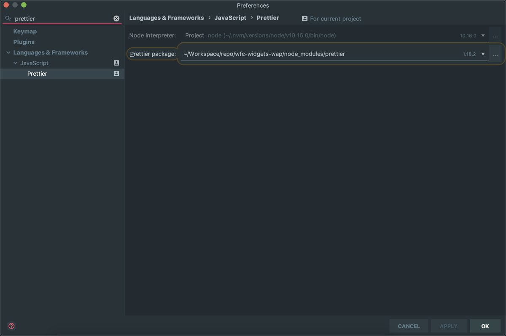
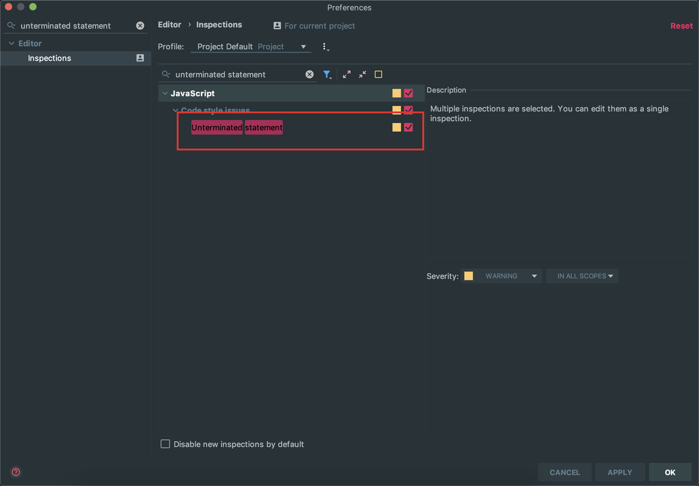
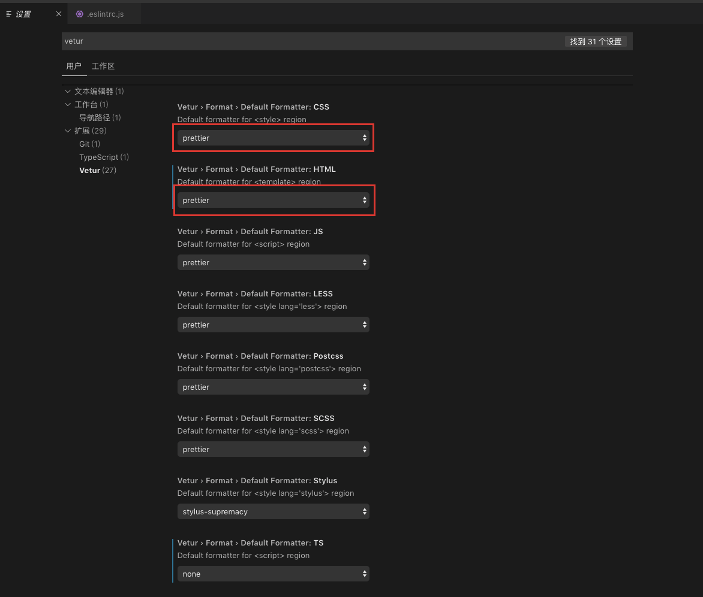

## 代码 Lint 与格式化规范配置手册

### 如何在项目中使用

#### npm 安装依赖

> Lint 规则参考 https://alloyteam.github.io/eslint-config-alloy/

```bash
npm i -D eslint @typescript-eslint/parser @typescript-eslint/eslint-plugin eslint-config-alloy eslint-config-prettier eslint-plugin-prettier eslint-plugin-vue husky lint-staged prettier
```

#### package.json 中增加

```json
"husky": {
 "hooks": {
  "pre-commit": "lint-staged"
 }
},
"lint-staged": {
 "*.{js,vue,ts}": [
  "eslint --fix",
  "git add"
 ]
}
```

#### 添加.eslintrc.js 文件

```js
module.exports = {
  root: true,
  env: {
    node: true,
  },
  extends: ["alloy", "alloy/typescript", "plugin:vue/essential", "prettier"],
  plugins: ["prettier"],
  parserOptions: {
    parser: "@typescript-eslint/parser",
    ecmaVersion: 2017,
    sourceType: "module",
  },
  rules: {
    eqeqeq: "off",
    "prettier/prettier": "error",
  },
};
```

#### 增加 .editorconfig 文件

```
[*.{js,jsx,ts,tsx,vue}]
charset = utf-8
end_of_line = lf
indent_size = 2
indent_style = space
insert_final_newline = true
max_line_length = 120
tab_width = 2
trim_trailing_whitespace = true

```

#### 增加 .prettierrc.js 文件

```js
module.exports = {
  trailingComma: "es5",
  tabWidth: 2,
  semi: false,
  singleQuote: true,
};
```

### IDE 设置

IDEA / Web Storm

#### **安装相关插件**

1. Prettier

1. File Watcher

**如何自动 Lint/格式化文件 参考：**

https://prettier.io/docs/en/webstorm.html#running-prettier-on-save-using-file-watcher

**检查项目是否启动 ESLint Prettier**




**手动格式化**

修改默认格式化快捷键为 Prettier

**关闭分号警告**

搜索 **unterminated statement 然后去掉 ✔️ 如下图**



VS Code

**安装相关插件**

1. Prettier

1. ESLint

1. EditorConfig

**如何自动 Lint/格式化文件**

在 VSCode 中，默认 ESLint 并不能识别 .vue、.ts 或 .tsx 文件，需要在「文件 => 首选项 => 设置里做如下配置：

```
{
  "eslint.validate": [
    "javascript",
    "javascriptreact",
    "vue",
    "typescript",
    "typescriptreact"
  ]
}
```

如果需要针对 .vue、.ts 和 .tsx 文件开启 ESLint 的 autoFix，则需要配置成：

```
{
  "eslint.autoFixOnSave": true,
  "eslint.validate": [
    "javascript",
    "javascriptreact",
    {
      "language": "vue",
      "autoFix": true
    },
    {
      "language": "typescript",
      "autoFix": true
    },
    {
      "language": "typescriptreact",
      "autoFix": true
    }
  ]
}
```

**Vue 文件格式化与 ESLint 冲突的问题**

修改下 vetur 的配置 保证 格式化使用 prettier



以上设置成功后应该达到的效果

1. 编辑代码时能标出与 Lint 规则冲突的代码

1. 文件保存时自动 Lint 并格式化代码

1. git commit 时自动检查暂存区代码是否符合 Lint/Prettier 不符合代码无法 commit

对于旧代码不符合 Lint 规则的情况

以上设置后 Lint 规则只会扫描加入到 git 暂存区的文件，即当前修改的文件.如果需要修改旧代码则需要解决旧代码的 Lint 问题。
